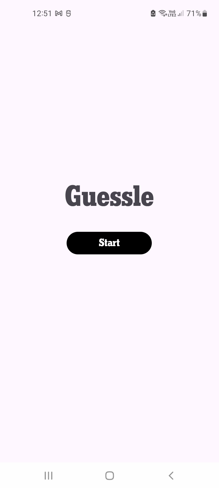
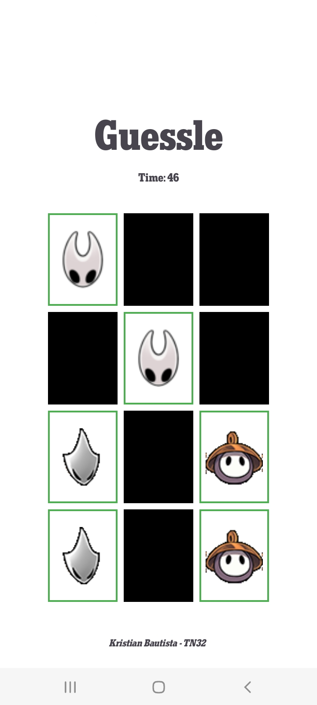

A classic card-matching memory game developed for the Android platform. This project is built using Kotlin and follows modern Android development practices.

## Features
- **Classic Gameplay**: Find and match pairs of cards.  
- **Difficulty Levels**: Choose between Easy, Medium, and Hard modes to challenge yourself.  
- **Timed Rounds**: Each game is timed, adding an extra layer of challenge.  
- **Clean UI**: A simple and intuitive user interface built with Material Design components.  

---

## Screenshots

*(It's highly recommended to add screenshots of your app here. They make the README much more engaging.)*  

## Screenshots
| Main Menu | Game Screen |
| :---: | :---: |
|  |  |


---

### Prerequisites
- Android Studio (latest version recommended)  
- An Android device or emulator running API level 26 or higher  

### Installation

1. **Clone the repo**
   ```bash
   git clone https://github.com/your-username/MemoryGame.git
   ```

2. **Open in Android Studio**
   - Launch Android Studio.  
   - Select **File > Open** and navigate to the cloned project directory.  
   - Let Gradle sync the project dependencies.  

3. **Run the App**
   - Select your desired emulator or connect a physical device.  
   - Click the **Run** button (▶) in Android Studio.  

---

## Built With
- **Kotlin** – The primary programming language.  
- **Android Jetpack**  
  - **View Binding**: To safely interact with views.  
  - **Activity & Fragment**: For managing app navigation and UI components.  
- **ConstraintLayout** – For creating complex and responsive layouts.  
- **Material Components for Android** – For modern UI elements like buttons, spinners, and themes.  

---

## Credits

This project uses **visual and thematic assets inspired by *Hollow Knight: Silksong***, developed and owned by **Team Cherry**.  
All rights to Silksong-related artwork, icons, and designs belong to **Team Cherry**.  
These assets are used **purely for educational and non-commercial purposes**.  

Additionally, this project takes **inspiration from the popular word game *Wordle***, developed by **Josh Wardle**.  

**Font & Icon Credits:**  
<div>Icons made from <a href="https://www.onlinewebfonts.com/icon">svg icons</a> is licensed by CC BY 4.0</div>  

Visit [https://www.teamcherry.com.au](https://www.teamcherry.com.au) to learn more about their amazing work.

---

## License

Distributed under the **MIT License**.  
See [`LICENSE`](LICENSE) for more information.
